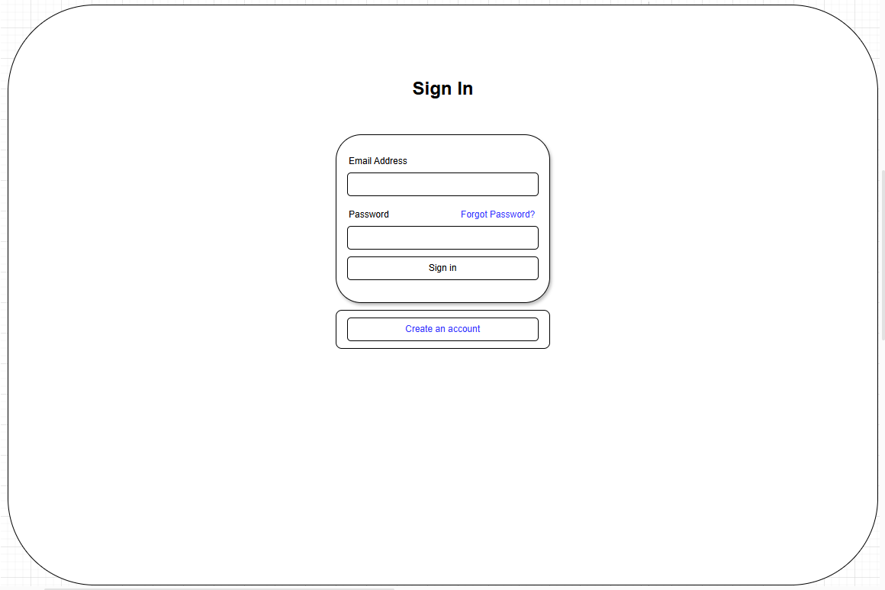

# Software Inception Report  

## 1. Introduction 

### Problem statement
The problem of not moving much while playing games affects people who play games the majority of the day; the impact of which is unhealthy life habits and an unhealthy body.

### Product Position Statement
For gamers who do not exercise enough, The Gaming Workout Hub is a website that tells users when it's time to get up and be active; unlike GetUp!, our product allows users the flexibility and customization of their workout plan.

### Value proposition and customer segment
Workout Gaming Hub is an exercise website that allows gamers to exercise while gaming at a desk, prioritizing customizability and tracking features based on the user.
Consumer segment: Gamers who sit at desks the majority of their day.

## 2. Stakeholders

Users: Casual gamers are the main audience for this website and they are who will be using the website to produce workouts and track their fitness.

Developers: As the developers we are in charge of building this website and taking feedback from users to continually update and improve the website.

Competitors: There are other apps and websites like GetUp that track workouts and they want the majority of market share and profit off of people aspiring to get in shape as well.

## 3. Functional requirements (features)  

1. User registration and login  
2. Game integration for downtime workouts  
3. Exercise recognition and login  
4. Customizable workout plans  
5. Rewarding and achievements system  
6. Quick workout mode  
7. Reminders and scheduling  
8. Progress tracking  
9. Calorie tracking  
10. Privacy and security  
11. Accessibility features  
12. Support and help center  

## 4. Non-functional requirements

### 1. Performance  
**Importance:** Users will epect a lag-free state when operating the software to access fitness data.  
**Goal:** Load times should be reduced to 5 seconds, and fitness response data should be updated within 5 seconds.  
  
### 2. Reliability  
**Importance:** Website availability should be available throughout the day without delays. Game monitoring should only be available while the program is active.  
**Goal:** Website should be available 99% of the time. If this is not the case, the website should be recovered within 5 minutes.  

### 3. Security
**Importance:** Personal data should be protected and should not be accessed by any unauthorized operator. Users should be constrained to only website access.  
**Goal:** User login information should be encrypted, and user workout schedules should be saved locally.  

### 4. Usability
**Importance:** Users should find the interface easy to use, and have clear navigation to start making schedules and being able to select their game.  
**Goal:** Conduct testing with our group and have a unanimous decision in deciding if its usability is acceptable.  

### 5. Compatibility
**Importance:** The website should work across multiple browsers with different resolutions.  
**Goal:** Will be tested on Chrome, Firefox, Opera, 1080p, 1440p, and select ultrawide resolutions.  

### 6. Maintainability
**Importance:** System should have an adaptable update process that will make adding new games and functions an easier process for developers.  
**Goal:** Adding new functions or games should not change the overall website code.  

### 7. Availability
**Importance:** Users should be able to access their data anytime of the day, anytime of the week without interruptions.  
**Goal:** Website should have a maximum downtime of 24 hours per year.  

## 5. Minimum Viable Product

### MVP Feature:

* Beginner Friendly workout: Different intensity of workouts allows for users new to workout.
* Personalization: Create a login and sign up page for user personalization, allowing them to select workouts to fit their personal needs.
* Reviews: Rate your workouts.
* Progression tracker: Ability to see your progression, adding data such as weight.
  
### Validation & Testing Approach:

* We can test the friendliness  of the workout by asking for instant feedback based on the amount of time given to do a certain amount of an exercise.
* User data will show activity on the website. As well as the personalization aspect of users.
* Manual testing on login and signup functionality.

## 6. Use cases
### **Use Case #1:** Log in to the website  
#### **Actor:** User   
#### **Trigger:** User decides to log in to the website  
#### **Pre-conditions:**    
1.User already has an account.  
2.User knows their account credentials.  
#### **Post-condition:** User is logged into their account.  
#### **Success Scenario:**  
1. User initiates request.  
2. Input credentials are validated.  
3. User is given access to their account.  
#### **Alternate Scenario #1:**  
1. User does not have a account.  
2. Application informs user of failure.  
3. Application asks user to try again or create an account.  
4. Application offers to reset their password.  
#### **Alternate Scenario #2:**  
1. User input the wrong credentials  
2. Application informs user of failure.  
3. Application asks user to try again or create an account.  
4. Application offers to reset their password.

### **Use Case #2:** Toggle Between Light and Dark Mode
#### **Actor:** User, Developer
#### **Trigger:** The user clicks the "Light/Dark Mode" toggle button on the webpage.
#### **Pre-conditions:** The user is on the website and has loaded the main page or any page containing the light/dark mode toggle.    
#### **Post-condition:** The site immediately displays in dark mode, providing the user with reduced glare and a different aesthetic.
#### **Success Scenario:**  
1. User clicks the toggle button (currently in Light Mode).
2. The website’s front-end JavaScript sends a request to update the theme preference.
3. Developer has implemented the logic that swaps the CSS theme from light to dark.
4. The site’s stylesheet updates accordingly, changing colors, backgrounds, and text.
5. If the user is logged in, the new theme preference is saved in their profile (so that it persists on the next visit).
  
.

### **Use Case #3:** Personalized Workout Plan Setup
#### **Actor:** User, Developer
#### **Trigger:** The user selects “Create Workout Plan” in their profile dashboard.
#### **Pre-conditions:** The user is registered on the website and is logged in. The workout plan feature is fully functional (implemented by the Developer).
#### **Post-condition:** The user’s personalized workout plan is stored in their profile. 
#### **Success Scenario:**  
1. User navigates to their dashboard and clicks “Create Workout Plan.”
2. The system (developed by the Developer) presents a form asking for the user’s fitness goals, available time slots, and preferred exercise types.
3. The user inputs details:
 - Time available (e.g., 15-minute break every 2 hours)
 - Desired intensity level
4. The system suggests a list of recommended exercises tailored to the user’s schedule (e.g., short cardio bursts, posture correction exercises, etc.).
5. The user reviews and customizes the plan (adding/removing exercises, adjusting duration).
6. The plan is saved to the user’s account, including recommended daily or weekly checkpoints.
  
.

### **Use Case #4:** Weekly Progress Tracking and Gamification
#### **Actor:** User, Developer
#### **Trigger:** The user checks their “Progress” page on the website at the end of the week or after completing daily exercises.
#### **Pre-conditions:** The user has created or selected a workout plan (See Use Case 2) or is tracking any fitness activity on the site.
#### **Post-condition:** The user feels motivated to maintain or exceed their fitness routine for the next week.
#### **Success Scenario:**  
1. User navigates to the “Progress” page.
2. The site (implemented by the Developer) fetches user’s logged activities (exercises done, workout duration, frequency).
3. The system calculates weekly progress (e.g., total minutes exercised, streaks maintained).
4. The user is awarded gamified points (e.g., XP) or a new badge if a milestone is reached (e.g., exercising 3 days in a row).
5. The progress page updates with a dynamic progress bar, badges, and possibly a place on a leaderboard among other users.
  
.

### **Use Case #5:** Create an account  
#### **Actor:** User   
#### **Trigger:**  User decides to create an account  
#### **Pre-conditions:** User has a valid email they can access    
#### **Post-condition:** User has an account they can access at any time  
#### **Success Scenario:**  
1. User initiates request  
2. User inputs a valid email and password
3. User confirms email
4. User is logged into their account
  
#### **Alternate Scenario #1:**  
1. User does not input a valid email  
2. User is informed of failure  
3. User is asked to try again  
 
#### **Alternate Scenario #2:**  
1. User does not input a valid password  
2. User is informed of failure  
3. User is shown requirements for passwords  
4. User is asked to try again  

### **Use Case #6:** User chooses which workouts they want to do today  
#### **Actor:** User   
#### **Trigger:** User starts a workout  
#### **Pre-conditions:**  User is logged in   
#### **Post-condition:** User is logged into their account.  
#### **Success Scenario:**    
1. User accesses website   
2. Application provides user with a list of workouts to do that day  
3. User selects a plan for the day  
4. User confirms selection  
5. Application saves user selection  

#### **Alternate Scenario #1:**  
1. User does not select a plan.  
2. User is informed of failure.  
3. User is asked to pick a plan.  
 

## 7. User stories
1. As a developer, I want a system that smoothly integrates fitness with gaming  so that I can ensure users stay motivated and committed without disruptions. (21 hours)  
2. As a casual gamer, I want short, simple exercises that work with my game and track my progress, so that I can work out without messing up my playtime. (8 hours)  
3. As a Platformer gamer, I want to exercise every time I die in game, so that I can work out when I fail a level. (5 hours)  
4. As a virtual reality gamer, I want to be able to do fitness challenges in game so I can get a workout while having an immersive experience. (13 hours)  
5. As a stakeholder, I want an engaging  and scalable fitness environment that will attract users and maintain concurrent usage so that the project will remain popular and have continued growth in the gaming market. (21 hours)  
6. As a First Person Shooter gamer, I want a website that takes into account when I can work out, so that I can work out without interrupting the game. (8 hours)  
7. As a simulator player, I want actions in game to be connected to movements in real life so that I can stay active while getting lost in the simulation. (5 hours)  
8. As a gamer, I want to be able to get a couple exercises during my later gaming hours so that I can get proper rest at night. (5 hours)  
9. As a college student, I want to be able to work and play games at the same time so I don’t fall behind in class while enjoying my time. (5 hours)  
10. As a full-time employee, I want a fitness program that integrates gaming sessions in the evening so I can keep up with my activeness despite my busy schedule. (5 hours)  
11. As a parent, I want my child to stay active while gaming so that they don’t ruin their health from too much screen time. (5 hours)  
12. As an avid Rust player, I want to build strength and endurance so that when hunting season comes around I will be in shape. (8 hours)  

## 8. Issue Tracker
