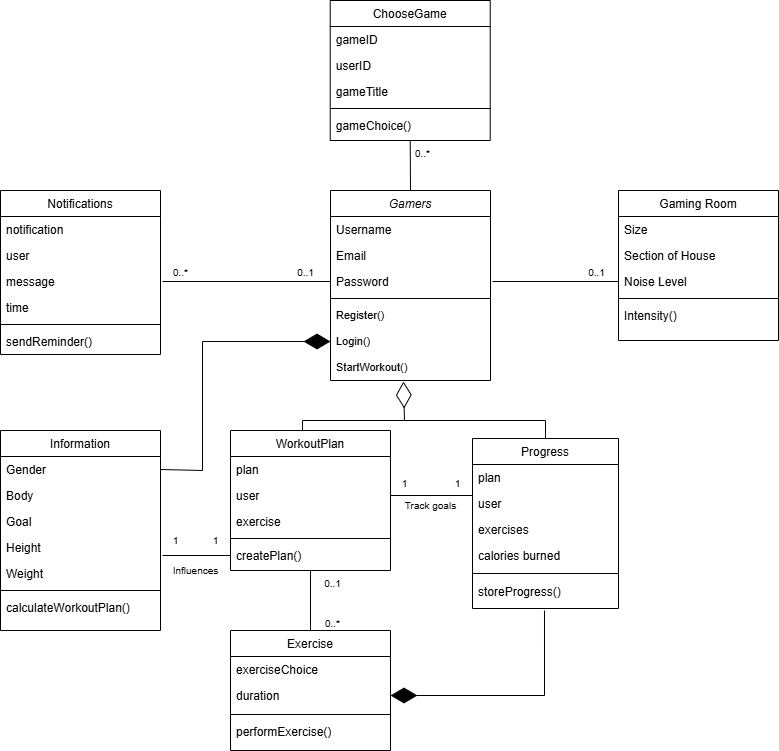

# Software Inception Report  

## System Description
The Gaming Workout Hub is a website that allows gamers to track their workouts and hold themselves accountable. The problem of not moving much while playing games affects people who play games the majority of the day; the impact of which is unhealthy life habits and an unhealthy body. Our product allows users the flexibility and customization of their workout plan, only if the client has added their information about them. Workout Gaming Hub is an exercise website that allows gamers to exercise while gaming, prioritizing customizability and tracking features based on the user.

  
When a **gamer** registers for the Gaming Workout Hub, they must provide their _username, email, and password_ which will be used to _**track**_ their workouts and progress. After their account is created they will input their body **information**, such as _gender, body, goal, height, and weight_ which will then be used to _**generate**_ the user **workout plan**. As the user _**completes and inputs**_ their **exercises** and _durations_, the system will _**track**_ their **progress**. Additionally, the user will be allowed to input details such as their **gaming room**, with its approximate _size_, _section of the house, and noise level_, along with their **chosen game** to _**tailor**_ their experience if the game is supported by a library of games on the Gaming Workout Hub. The user will also be asked if they want **notifications** to _**remind**_ the user to work out and when is the best _time_ for them on an average day. With all of these features, the Gaming Workout Hub could potentially be an excellent way to help gamers stay in shape  

## Model

