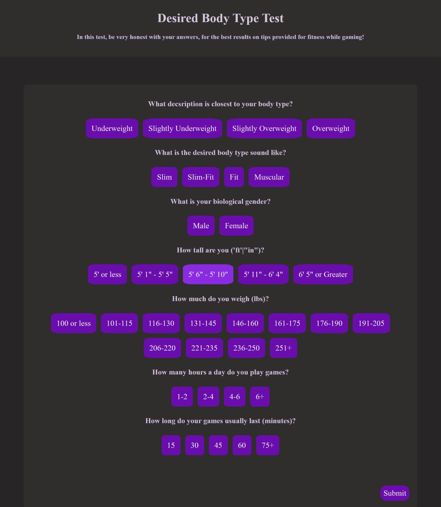

# Implementation 1
## 1. Introduction
Gaming Workout Hub is an exercise website that allows gamers to exercise while gaming, prioritizing customizability and tracking features based on the user. This website will make exercising at home fun and easy by letting gamers play games and get alarms of when to exercise and or check off a list of exercises they can customize. The gamer will be able to customize exactly what they want for their workout, allowing for a flexible schedule that caters to the gamers needs and wants. https://github.com/amb2893/CS386Project

## 2. Implemented Requirements
#### Requirement
> Requirement: "As a gamer, I want to be able to take a test about my information so that I can achieve my goal faster."
- Issue: https://github.com/amb2893/CS386Project/issues/66
- Pull request: https://github.com/amb2893/CS386Project/pull/65
    - Implemented by: Luke Shahan / Preston Smith
    - Approved by: @prestonimus approved this pull request.

Print screen: 

#### Requirement
> Requirement As a gamer who plays many types of games, I want the ability to customize and scale the tasks I do and how long I do them for depending on what game I am playing.
- Issue: https://github.com/amb2893/CS386Project/issues/38 
- Pull request: https://github.com/amb2893/CS386Project/pull/63 
    - Implemented by: Anthony Birk 
    - Approved by: Preston Smith
  
Print Screen:

## Tests
You should implement automated tests that aim to verify the correct behavior of your code. Provide the following information:
Test framework you used to develop your tests (e.g., JUnit, unittest, pytest, etc.)
Link to your GitHub folder where your automated unit tests are located.
An example of a test case. Include in your answer a GitHub link to the class being tested and to the test.
A print screen showing the result of the execution of the automated tests. 
Grading criteria (3 points): You should have an adequate number of automated tests. They should be well-written to exercise the main components of your system, covering the relevant inputs.

## Technology
List the adopted technologies with a brief description and justification for choosing them.

Grading criteria (1 point): This section will be evaluated in terms of correctness, completeness, thoroughness, consistency, coherence, and adequate use of language.

## Deployment
Provide a link for the system in production and describe how you are deploying your system. 

Some alternatives for deploying your system in the cloud:

AWS. AWS Educate offers free credits for students. See the tutorial at https://docker-curriculum.com/ on how to create a container and deploy it on AWS. ]
Digital Ocean or Azzure. As part of the GitHub Education benefits, as a student, you can get $100 at Digital Ocean and $100 at Microsoft Azzure cloud computing platforms (see more details at https://education.github.com/students)Links to an external site..
Oracle Cloud. Oracle offers a free tier in its cloud environment that should be more than enough for your needs.
Firebase. Firebase can be a good choice if you are building a mobile phone app.
Grading criteria (3 points): This section will be graded based on the adequate use of the technology and its adequate description.

## Licensing
We have selected to use the MIT License for our source code because it allow contributors or users to use and or modify our source code. That is if and only if they include the original copyright notice.

## Readme File
You should also prepare your repository for receiving new contributors. You should prepare a Readme.md file. See an example at https://gist.github.com/PurpleBooth/109311bb0361f32d87a2   In the Readme file, the current version should be stated. You should follow the Semantic Versioning schema (https://semver.org/). Tag the GitHub repository accordingly (https://git-scm.com/book/en/v2/Git-Basics-Tagging). 

Your repository should contain a CONTRIBUTING.md file, a LICENSE file, and a CODE_OF_CONDUCT.md file. Search online for some examples of these files. In this section of the deliverable, put links to these files on GitHub.

Grading criteria (3 points): This section will be based on the presence and quality of the information presented in the files.

## UX Design
Describe the approach you adopted to design your user interface. Include some screenshots.

Grading criteria (3 points): This section will be graded based on the appearance (aesthetics) and usability (ease of use) of the system.

## Lessons Learned
In retrospective, describe what your team learned during this first release and what you are planning to change for the second release. 

Grading criteria (2 points): Adequate reflection about problems and solutions, clear description with adequate use of language. 

## Demo
Include a link to a video showing the system working.

Grading criteria (5 points): This section will be graded based on the quality of the video and on the evidence that the features are running as expected. Additional criteria are the relevance of the demonstrated functionalities, the correctness of the functionalities, and the quality of the developed system from the external point of view (user interface).

## Teamwork
