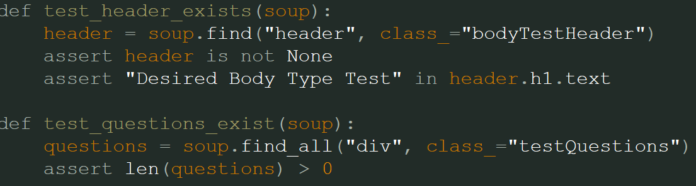

# Implementation 1
## 1. Introduction
Gaming Workout Hub is an exercise website that allows gamers to exercise while gaming, prioritizing customizability and tracking features based on the user. This website will make exercising at home fun and easy by letting gamers play games and get alarms of when to exercise and or check off a list of exercises they can customize. The gamer will be able to customize exactly what they want for their workout, allowing for a flexible schedule that caters to the gamers needs and wants. https://github.com/amb2893/CS386Project

## 2. Implemented Requirements
#### Requirement
> Requirement: "As a gamer, I want to be able to take a test about my information so that I can achieve my goal faster."
- Issue: https://github.com/amb2893/CS386Project/issues/66
- Pull request: https://github.com/amb2893/CS386Project/pull/65
    - Implemented by: Luke Shahan / Preston Smith
    - Approved by: Preston Smith

Print screen: 

#### Requirement
> Requirement: "As a gamer who plays many types of games, I want the ability to customize and scale the tasks I do and how long I do them for depending on what game I am playing."
- Issue: https://github.com/amb2893/CS386Project/issues/38 
- Pull request: https://github.com/amb2893/CS386Project/pull/63 
    - Implemented by: Anthony Birk 
    - Approved by: Preston Smith
  
Print Screen:

#### Requirement
> Requirement: "As a gamer, I want to be able to look at a aesthetic website so that it is easy to nagigate and understand what is what."
- Issue: https://github.com/amb2893/CS386Project/issues/20
- Pull request: https://github.com/amb2893/CS386Project/pull/75
    - Implemented by: Franz Mischke
    - Approved by: Anthony Birk

Print screen: 

  
#### Requirement
> Requirement: "As a gamer, I want to be able to hear an audio cue so that I know when to stop working out to get back to playing games."
- Issue: [https://github.com/amb2893/CS386Project/issues/68](https://github.com/amb2893/CS386Project/issues/68)
- Pull request: [https://github.com/amb2893/CS386Project/pull/76](https://github.com/amb2893/CS386Project/pull/76)
    - Implemented by: Jalen Jensen
    - Approved by: Anthony Birk
  
Print Screen:  
  

#### Requirement
> Requirement: "As a gamer, I want to be able to contact through the website so that I can get my problems resolved."
- Issue: [https://github.com/amb2893/CS386Project/issues/69](https://github.com/amb2893/CS386Project/issues/69)
- Pull request: [https://github.com/amb2893/CS386Project/pull/77](https://github.com/amb2893/CS386Project/pull/77)
    - Implemented by: Mayanna John
    - Approved by: Anthony Birk   
  
Print Screen:  
  

#### Requirement
> Requirement: "As a gamer, I want a website to perform simple exercises while I'm gaming."
- Issue: [[https://github.com/amb2893/CS386Project/issues/68](https://github.com/amb2893/CS386Project/issues/35)]
- Pull request: https://github.com/amb2893/CS386Project/pull/70
    - Implemented by: Preston Smith
    - Approved by: Anthony Birk
  
Print Screen:  

## Tests
**Test Framework:** pytest - checks through HTML file to check everything is created  
  
**Example test case:** The following is an automated test that parses through an HTML file, looks for associated class variables, and makes sure that all classes are available and exist. If everything exists and is within the HTML file, it will return a success.  
  
**GitHub Automated Test File:** [GitHub](https://github.com/amb2893/CS386Project/blob/testHTML/PyTests/test_html.py)  

The test should run as follows:  
1. Loads HTML content from file (also checks to see if file exists)
2. Tests if the title is correct
3. Tests if the header exists
4. Tests if questions exists
5. Tests if all button classes exist
6. Test if you can submit
7. Sees if stylesheet is implemented correctly
8. Checks if there is a script file
9. Exits  
  
### Tests 1 & 2:  
  
  
### Tests 3 & 4:  

  
### Tests 5:  
  
  
### Tests 6-9:  
  
  
### Results:  
  

You should implement automated tests that aim to verify the correct behavior of your code. Provide the following information:
Test framework you used to develop your tests (e.g., JUnit, unittest, pytest, etc.)
Link to your GitHub folder where your automated unit tests are located.
An example of a test case. Include in your answer a GitHub link to the class being tested and to the test.
A print screen showing the result of the execution of the automated tests. 
Grading criteria (3 points): You should have an adequate number of automated tests. They should be well-written to exercise the main components of your system, covering the relevant inputs.

## Technology  
* HTML/CSS – Building & styling  
* JavaScript – Functionality  
* Discord – Communication  
* GitHub – Tracking & managing  
* Neocities – Web hosting  

## Deployment

Link to our website: https://gamingworkouthub.neocities.org/

## Licensing
We have selected to use the MIT License for our source code because it allow contributors or users to use and or modify our source code. That is if and only if they include the original copyright notice.

## Readme File

Link to Readme File: https://github.com/amb2893/CS386Project/blob/main/README.md
Link to Code of Conduct: https://github.com/amb2893/CS386Project/blob/testHTML/CODE_OF_CONDUCT.md
Link to License: https://github.com/amb2893/CS386Project/blob/testHTML/LICENSE
Link to Contributing: https://github.com/amb2893/CS386Project/blob/testHTML/CONTRIBUTING.md

## UX Design
Before we started building the website we all discussed and came up with a color theme for our website and as the website was built more and more we set some standardized colors which we would use for each section of the website. We wanted a dark-themed website with purple as the primary accent, so most of our website is black to dark grey, with most of the functional parts of the website being a dark purple color.

## Lessons Learned
For our team's first release, we learned that we need to communicate better with everyone in the group. Most of our conversations are usually just two people talking with one another, but we need to make it about everyone. These incidents made us not understand some pieces of code and made it longer for the issues to be resolved. As of now the problems have now been fixed and communication has improved.

## Demo

