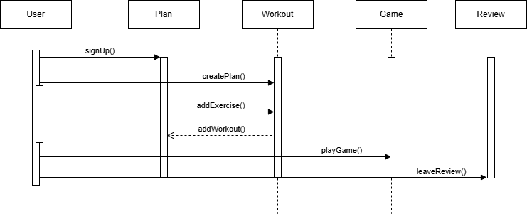
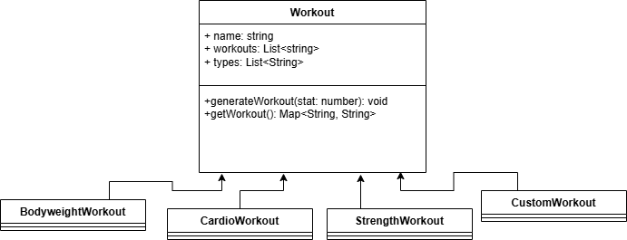

# Description
Our system, called the Gaming Workout Hub, helps gamers stay healthy by encouraging them to work out while they play. The architecture has a front end made with JavaScript, HTML, and CSS, a back end made with Node.js, and a media folder that holds the sounds we've used on the site. The front end handles and shows the parts that users can see and use. The back end sets up the server, runs it, and takes care of user info. Together, these parts make a unique and dynamic user experience for gamers who visit the website.  

In order to keep the system organized and easy to keep track of, we opted for using certain design patterns and principles. We are using the Abstract Factory pattern to manage different types of workout plans like weight loss, maintenance, and muscle gain. Next, the Singleton pattern is for sending notifications so that only one notification system is used for each gamer. Software design principles we followed are single responsibility, open-closed, and the Liskov Substitution to make sure that each part of the system follows one job and cooperates well with other sections.  

# Architecture

Most of our applications are contained within the Gaming Workout Hub folder. Within this folder, we have a back-end folder, front end folder, and a media folder. Within the media folder, we contain any sounds that are used in the website. Within the front-end folder, we have a JavaScript folder and an HTML/CSS folder to build the website. Within the back-end folder, we just have a node folder for now, to launch the server and connect with the database, and store user data. All of these work together to build our web application but leave plenty of opportunities to expand the functionality without causing issues with the existing functionality.

# Class Diagrams

## Class Diagram Summary – Gaming Workout Hub
### The class diagram represents the structure and relationships between the core components of the Gaming Workout Hub system. It models how users interact with games, workouts, and fitness plans in the app.

- User: Represents a registered member who can create workout plans, leave reviews, and track progress.

- Game: Represents a video game that workouts can be themed around or paired with.

- Plan: A personalized workout plan linking a user to a game and containing multiple workouts.

- Workout: A fitness session that belongs to a plan and contains a series of exercises.

- Exercise: Individual physical tasks (e.g., push-ups, squats) that belong to a workout.

- Review: A user's rating and feedback on a specific game.

### The diagram includes implementation-level details such as data types, visibility (public, private), parameters, and return types. It also shows associations, such as one user having many plans, or a plan including multiple workouts.

### This diagram helps developers understand, build, and maintain the system by clearly showing how all parts of the backend interact.

# Sequence Diagrams
  
## Use Case  
### Actors:  
User  
### Interests:  
User: Wants to create a personalize workout plan to be able to track fitness progression tied with game motivation. Wants to be able to share feedback at the end.  
System: Ensures data storage and interacts correctly with the user to provide a seamless experience.  
### Flow:  
1. User registers and logs in.
2. User "creates plan"
3. User adds exercises to plan
4. User then gets a created workout plan back
5. User decides game to play
6. User leaves review at the end of game time

# Design Patterns
### Abstract Factory Design Pattern

### Strategy Design Pattern

# Design Principles

## 1. Single Responsibility Principle (SRP)

The function pageTransition(title, subtitle, html) is responsible only for handling page transitions, ensuring a smooth layout change without interfering with workout logic.

Similarly, generateWorkout(amount) focuses on determining the workout to be displayed, keeping responsibilities separate.

## 2. Open-Closed Principle (OCP)

The workout objects (bodyweight, cardio, etc.) are structured in a way that allows adding new workouts without modifying existing code. A new workout can be introduced by creating another object with the same structure.

The function parseCustomWorkout() processes custom workouts dynamically without modifying predefined workout structures.

## 3. Liskov Substitution Principle (LSP)

The confirmQuestion(obj) function works with any workout object (bodyweight, custom, etc.) as long as it has a name property, allowing consistent behavior regardless of the workout type.

generateWorkout(amount) supports both time-based and rep-based workouts interchangeably by checking curType, ensuring that different types of workouts can be used without breaking functionality.

