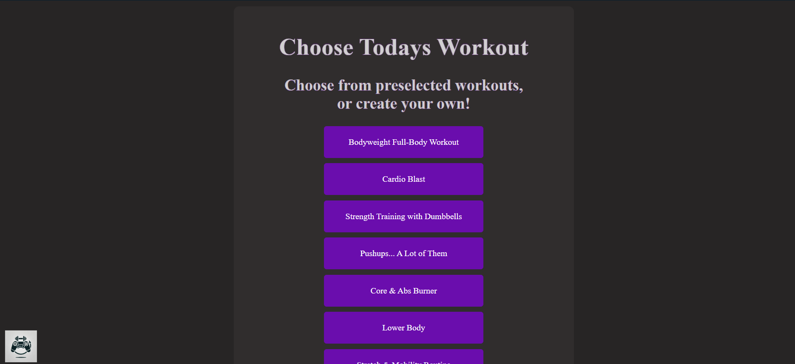
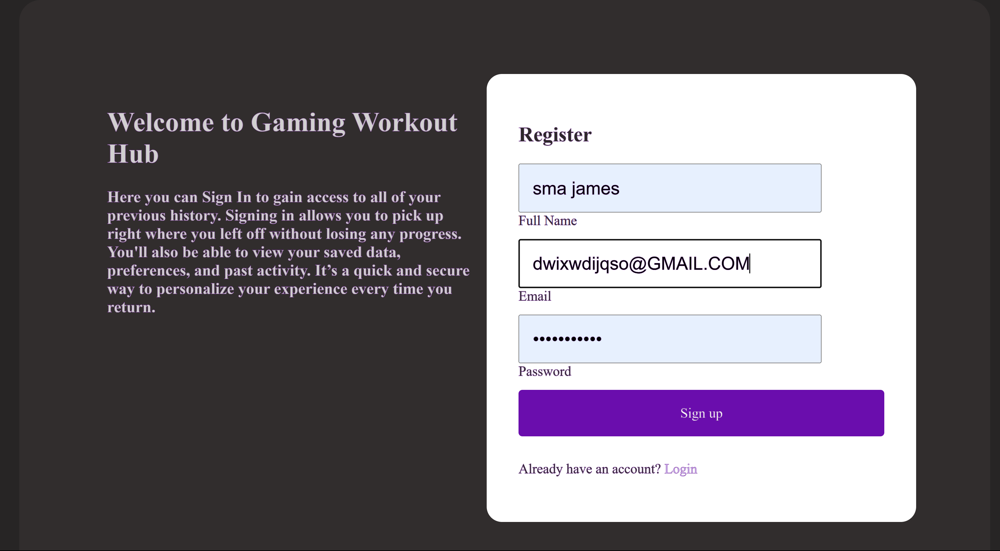
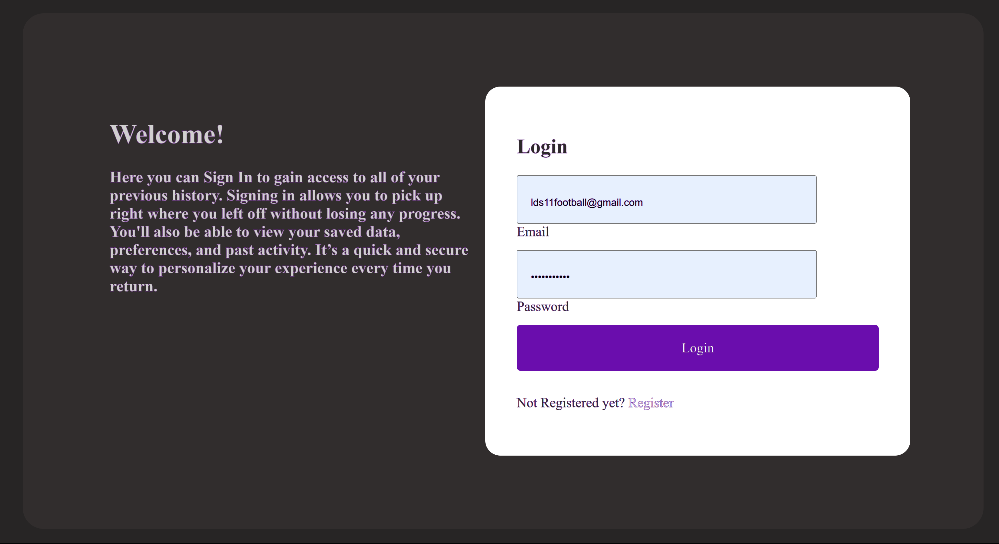
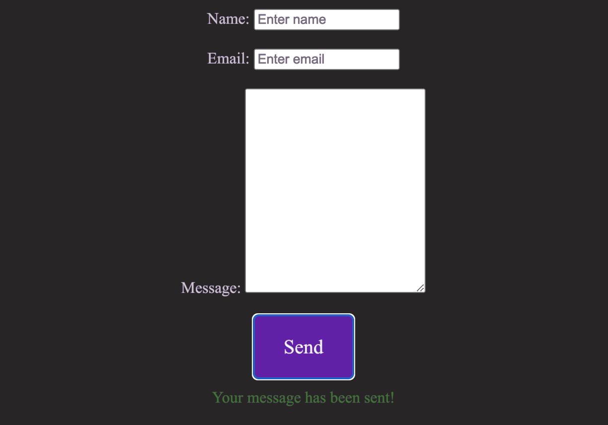
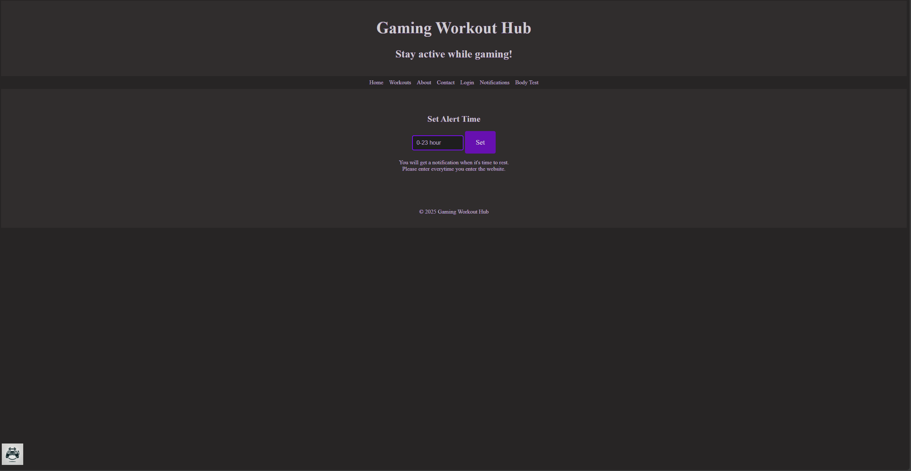

# Implementation 1
## 1. Introduction
Gaming Workout Hub is an exercise website that allows gamers to exercise while gaming, prioritizing customizability and tracking features based on the user. This website will make exercising at home fun and easy by letting gamers play games and get alarms of when to exercise and or check off a list of exercises they can customize. The gamer will be able to customize exactly what they want for their workout, allowing for a flexible schedule that caters to the gamers needs and wants. https://github.com/amb2893/CS386Project

## 2. Implemented Requirements
#### Requirement
> Requirement: "As a gamer who is very busy, I want to be able to easily and quickly get from one task to another with one click of a logo for ease and convenience."
- Issue: [https://github.com/amb2893/CS386Project/issues/38 ](https://github.com/amb2893/CS386Project/issues/89)
- Pull request: [https://github.com/amb2893/CS386Project/pull/63](https://github.com/amb2893/CS386Project/pull/90) 
    - Implemented by: Anthony Birk 
    - Approved by: Preston Smith

Print Screen:

> Requirement: "As a gamer, I want to be able to log in so all of my previous infomation can be stored."
- Issue: https://github.com/amb2893/CS386Project/issues/71
- Pull request: https://github.com/amb2893/CS386Project/pull/88
    - Implemented by: Luke Shahan
    - Approved by: Anthony Birk

Print Screen: 

> Requirement: "As a gamer, I want to be able to send feedback or issues I have with the website so I can have a better experience."
- Issue: [#91](https://github.com/amb2893/CS386Project/issues/91)
- Pull request: [#93](https://github.com/amb2893/CS386Project/pull/93)
    - Implemented by: Mayanna John 
    - Approved by: Anthony Birk

Print Screen:

> Requirement: "As a gamer, I want a notification to rest, since rest is important to be healthy."
- Issue: [https://github.com/amb2893/CS386Project/issues/38 ](https://github.com/amb2893/CS386Project/issues/89)
- Pull request: [https://github.com/amb2893/CS386Project/pull/63](https://github.com/amb2893/CS386Project/pull/90) 
    - Implemented by: Franz Mischke
    - Approved by: 

Print Screen:

## Tests

## Demo 

## Code Quality
Our team followed consistent code conventions such as clear section labeling (///////////////////////////////) and camelCase naming for variables and functions to enhance readability. We adopted modular function design and reused logic with helper functions like pageTransition() to keep the codebase clean and DRY (Don't Repeat Yourself). Additionally, we used meaningful naming and grouped related functionality, which helped us maintain high code quality and streamline future development or debugging efforts.

## Lesson Learned
Our team learned the importance of communication while working on a large scale coding project. We learned how valuable having a clear plan and deadlines are, and how following them may be difficult but is better in the long run. If we were to start this release again we would definetely make more solid plans and goals for each person and make sure everyone meets the deadlines. 
