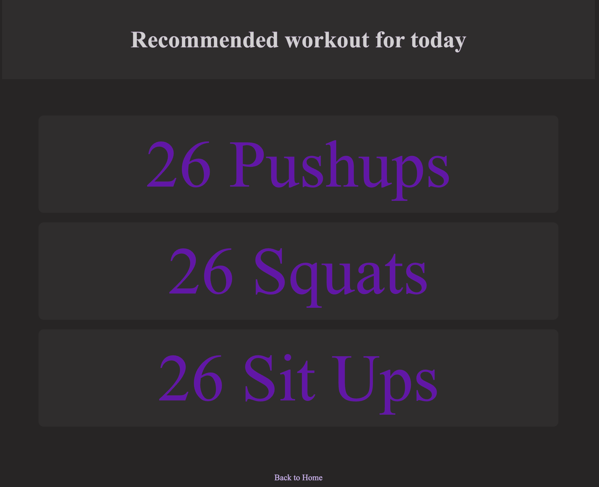
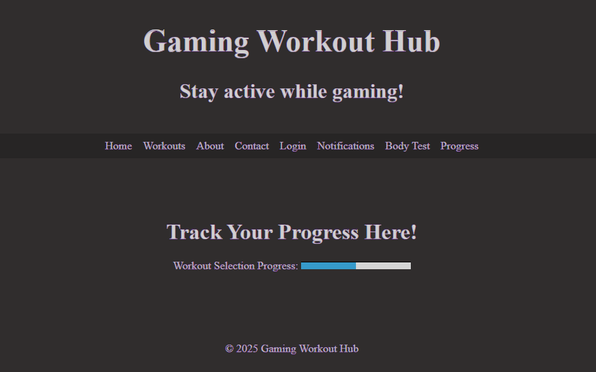
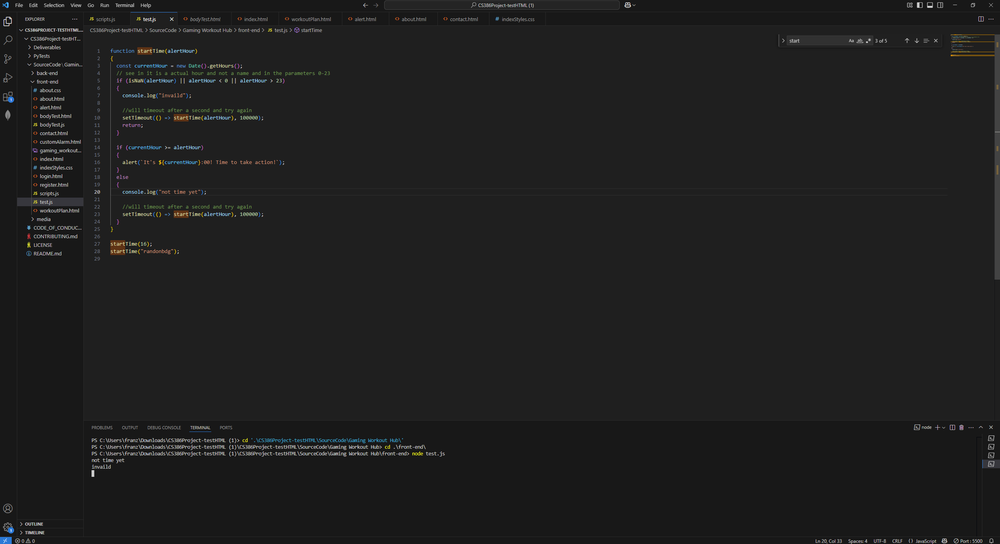
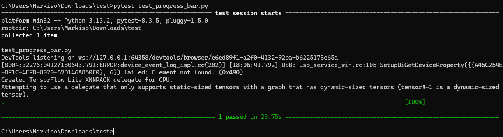

# Implementation 1
## 1. Introduction
Gaming Workout Hub is an exercise website that allows gamers to exercise while gaming, prioritizing customizability and tracking features based on the user. This website will make exercising at home fun and easy by letting gamers play games and get alarms of when to exercise and or check off a list of exercises they can customize. The gamer will be able to customize exactly what they want for their workout, allowing for a flexible schedule that caters to the gamers needs and wants. https://github.com/amb2893/CS386Project

## 2. Implemented Requirements
#### Requirement
> Requirement: "As a gamer who is very busy, I want to be able to easily and quickly get from one task to another with one click of a logo for ease and convenience."
- Issue: [https://github.com/amb2893/CS386Project/issues/38 ](https://github.com/amb2893/CS386Project/issues/89)
- Pull request: [https://github.com/amb2893/CS386Project/pull/63](https://github.com/amb2893/CS386Project/pull/90) 
    - Implemented by: Anthony Birk 
    - Approved by: Preston Smith

Print Screen:

> Requirement: "As a gamer, I want to be able to log in so all of my previous infomation can be stored."
- Issue: https://github.com/amb2893/CS386Project/issues/71
- Pull request: https://github.com/amb2893/CS386Project/pull/88
    - Implemented by: Luke Shahan
    - Approved by: Anthony Birk

Print Screen: 

> Requirement: "As a gamer, I want to be able to send feedback or issues I have with the website so I can have a better experience."
- Issue: [#91](https://github.com/amb2893/CS386Project/issues/91)
- Pull request: [#93](https://github.com/amb2893/CS386Project/pull/93)
    - Implemented by: Mayanna John 
    - Approved by: Anthony Birk

Print Screen:

> Requirement: "As a gamer, I want a notification to rest, since rest is important to be healthy."
- Issue: [https://github.com/amb2893/CS386Project/issues/38 ](https://github.com/amb2893/CS386Project/issues/42)
- Pull request: [https://github.com/amb2893/CS386Project/pull/63](https://github.com/amb2893/CS386Project/pull/) 
    - Implemented by: Franz Mischke
    - Approved by: 

Print Screen:

> Requirement: "As a beginner to workouts, I want a daily recommended workout so that I can have a general guide for at-home exercises"
- Issue: [#92](https://github.com/amb2893/CS386Project/issues/92)
- Pull request: [#93](https://github.com/amb2893/CS386Project/pull/93)
    - Implemented by: Preston Smith 
    - Approved by: Anthony Birk

Print Screen:

> Requirement: "As a gamer following a workout routine, I want to be able to see a progress bar that updates every workout to visual track my how much I have done."
- Issue: [#72](https://github.com/amb2893/CS386Project/issues/72)
- Pull request: [#94](https://github.com/amb2893/CS386Project/pull/94)
    - Implemented by: Jalen Jensen
    - Approved by:

Print Screen:  

## Tests
Automated test for startTime() function. The requires the installation of node on your VS code. You would just run node test.js and it will test the parameter that are given.

Automated test for checking if the progress bar will increment by 1 after "finishing" a workout. Using Python and Selenium for automated website interaction, we were able to get a passing score with how our progress bar is implemented. Below is how the test is carried out:
1. Opens website on local hosted server
2. Navagates to "Workouts" page
3. Clicks to first workout
4. Accepts the workout
5. Chooses time based
6. Inputs 3 seconds for the time
7. Waits of timer to hit zero so progress bar can be incremented
8. Goes back to "Home"
9. Goes to "Progress"
10. Verifies the bar has been incremented to 1.

## Demo 

## Code Quality
Our team followed consistent code conventions such as clear section labeling (///////////////////////////////) and camelCase naming for variables and functions to enhance readability. We adopted modular function design and reused logic with helper functions like pageTransition() to keep the codebase clean and DRY (Don't Repeat Yourself). Additionally, we used meaningful naming and grouped related functionality, which helped us maintain high code quality and streamline future development or debugging efforts.

## Lesson Learned
Our team learned the importance of communication while working on a large scale coding project. We learned how valuable having a clear plan and deadlines are, and how following them may be difficult but is better in the long run. If we were to start this release again we would definetely make more solid plans and goals for each person and make sure everyone meets the deadlines. 
